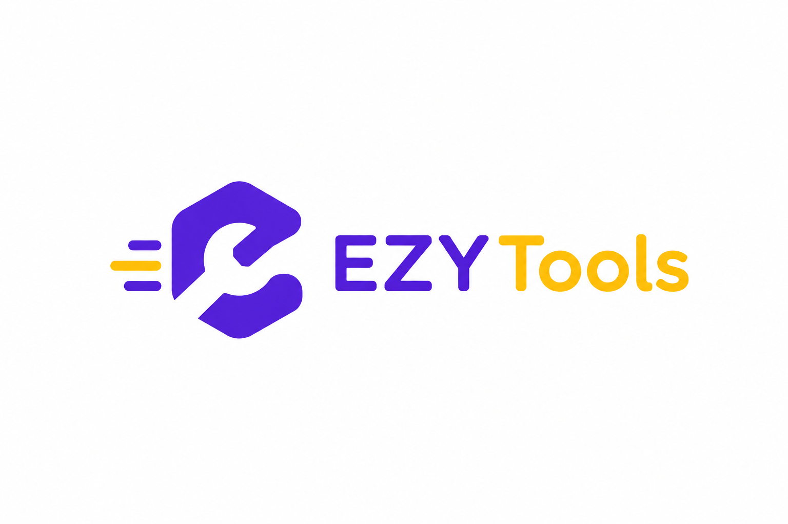

# 🎯 EzyTools - Free Online Tools

[](https://nextjs.org/)
[](https://www.typescriptlang.org/)
[](https://fastapi.tiangolo.com/)
[](https://www.python.org/)
[](https://tailwindcss.com/)
[](LICENSE)

A collection of free online tools to make everyday digital tasks easier. No registration required. No paywalls. Just simple, fast tools.



---

## ✨ Features

### 📱 Social Media Downloaders
- **YouTube Downloader** - Download videos in multiple qualities (720p, 1080p, 4K)
- **Facebook Downloader** - Save videos and reels from Facebook
- **Instagram Downloader** - Download photos, videos, and reels
- **TikTok Downloader** - Save TikTok videos without watermark

### 📄 PDF Tools
- **Merge PDF** - Combine multiple PDF files into one
- **Split PDF** - Split large PDFs into smaller files
- **Compress PDF** - Reduce PDF file size
- **Extract Text** - Extract text content from PDF documents

---

## 🛠️ Tech Stack

| Layer | Technology |
|-------|------------|
| **Frontend** | Next.js 16, TypeScript, Tailwind CSS |
| **Backend** | Python 3.11, FastAPI |
| **Video Processing** | yt-dlp, ffmpeg |
| **PDF Processing** | PyPDF2, Pillow |
| **HTTP Client** | Axios |
| **Icons** | Lucide React |
| **Deployment** | Vercel (Frontend), Render (Backend) |

---

## 🚀 Run Locally

### Prerequisites

| Tool | Version |
|------|---------|
| Python | 3.11+ |
| Node.js | 18+ |
| ffmpeg | Latest |

### Clone the Project

```bash
git clone https://github.com/janidumadawa/ezy-tools.git
cd ezy-tools
```

### Backend Setup

```bash
cd backend

# Create virtual environment
python -m venv venv

# Activate virtual environment
# Windows:
venv\Scripts\activate
# Mac/Linux:
source venv/bin/activate

# Install dependencies
pip install -r requirements.txt

# Run the server
python run.py
```

Backend runs at: `http://localhost:8000`

### Frontend Setup

```bash
cd ../frontend

# Install dependencies
npm install

# Create environment file
echo "NEXT_PUBLIC_API_URL=http://localhost:8000" > .env.local

# Run development server
npm run dev
```

Frontend runs at: `http://localhost:3000`

---

## 📁 Project Structure

```
ezy-tools/
├── backend/
│   ├── app/
│   │   ├── main.py              # FastAPI application
│   │   ├── config.py            # Configuration
│   │   ├── routers/             # API routes
│   │   │   ├── youtube.py
│   │   │   ├── facebook.py
│   │   │   ├── instagram.py
│   │   │   ├── tiktok.py
│   │   │   └── pdf.py
│   │   ├── services/            # Business logic
│   │   │   ├── youtube_service.py
│   │   │   ├── facebook_service.py
│   │   │   ├── instagram_service.py
│   │   │   ├── tiktok_service.py
│   │   │   └── pdf_service.py
│   │   └── utils/               # Shared utilities
│   │       └── downloader.py
│   ├── requirements.txt
│   └── run.py
├── frontend/
│   ├── src/
│   │   ├── app/                 # Next.js pages
│   │   │   ├── youtube/
│   │   │   ├── facebook/
│   │   │   ├── instagram/
│   │   │   ├── tiktok/
│   │   │   └── pdf/
│   │   ├── components/          # React components
│   │   ├── hooks/               # Custom hooks
│   │   └── types/               # TypeScript types
│   └── package.json
└── README.md
```

---

## 🔌 API Endpoints

| Method | Endpoint | Description |
|--------|----------|-------------|
| GET | `/api/youtube/info?url=` | Get YouTube video info |
| POST | `/api/youtube/download` | Download YouTube video |
| GET | `/api/facebook/info?url=` | Get Facebook video info |
| POST | `/api/facebook/download` | Download Facebook video |
| GET | `/api/instagram/info?url=` | Get Instagram media info |
| POST | `/api/instagram/download` | Download Instagram media |
| GET | `/api/tiktok/info?url=` | Get TikTok video info |
| POST | `/api/tiktok/download` | Download TikTok video |
| POST | `/api/pdf/merge` | Merge PDF files |
| POST | `/api/pdf/split` | Split PDF file |
| POST | `/api/pdf/compress` | Compress PDF file |
| POST | `/api/pdf/extract-text` | Extract text from PDF |

---

## 🎨 Color Themes

Each tool has its own brand-inspired color theme:

| Tool | Color | Hex |
|------|-------|-----|
| YouTube | Red | `#ff0133` |
| Facebook | Blue | `#1877F2` |
| Instagram | Pink | `#e1306c` |
| TikTok | Cyan/Black | `#00f2ea` |
| PDF Tools | Orange/Indigo | `#f97316` |

---

## ⚠️ Known Issues

- **YouTube**: Blocked on cloud hosting due to Google's datacenter IP restrictions (works perfectly on localhost)
- **Instagram**: Requires authentication cookies for cloud deployment (works perfectly on localhost)
- **Large Files**: Render free tier has 512MB RAM limit, may timeout on very large files

---

## 🚧 Coming Soon

- [ ] Image compression tools
- [ ] File format converters (PNG to JPG, PDF to Word)
- [ ] QR code generator
- [ ] URL shortener
- [ ] YouTube & Instagram cloud fix
- [ ] Batch download support
- [ ] Dark/Light theme toggle

---

## 📄 License

This project is for educational purposes only. Please respect the terms of service of the platforms you download from.

---

## 👨‍💻 Developer
- Website - [Janidu Madawa](https://imjanidu.vercel.app/)
- GitHub: [@janidumadawa](https://github.com/janidumadawa)
- LinkedIn: [Janidu Madawa](https://www.linkedin.com/in/janidu-madawa/)

---
